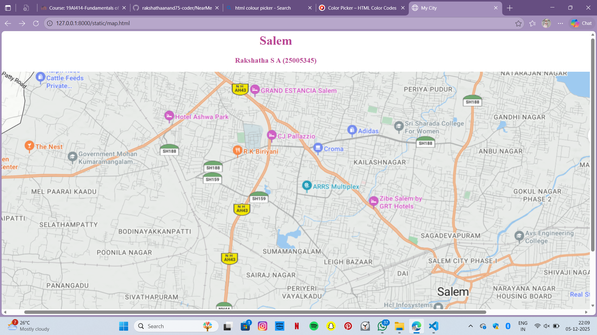
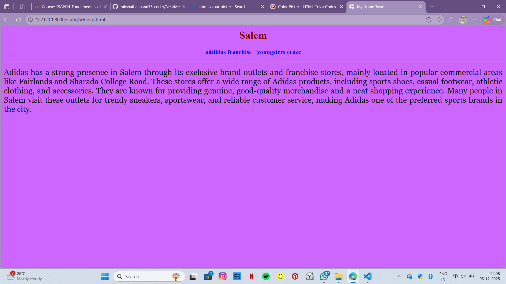
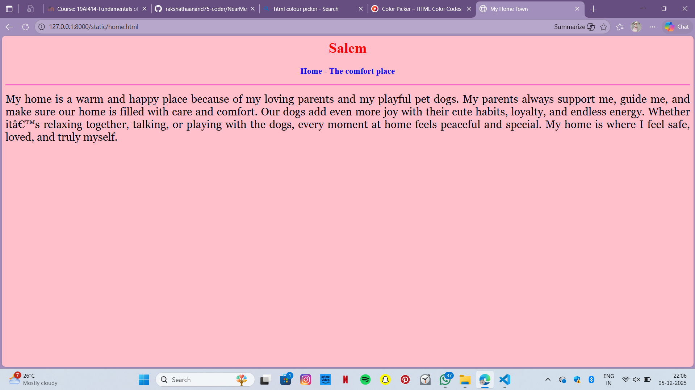
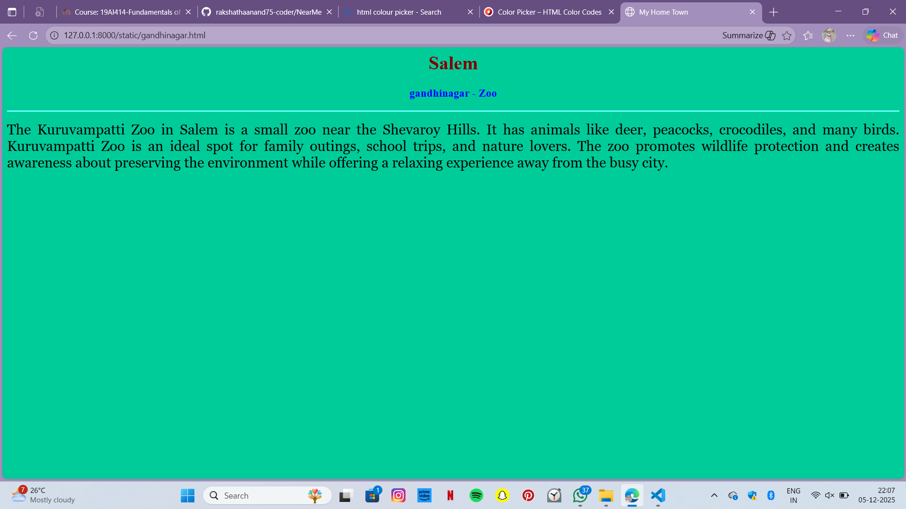
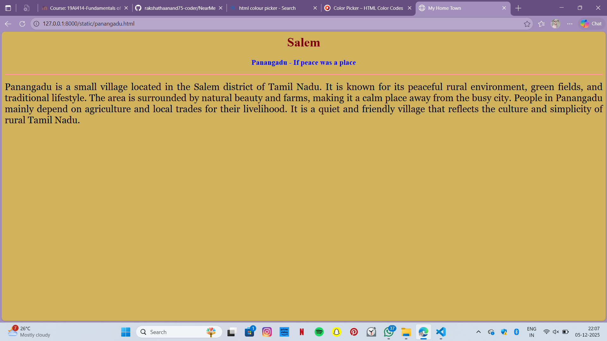
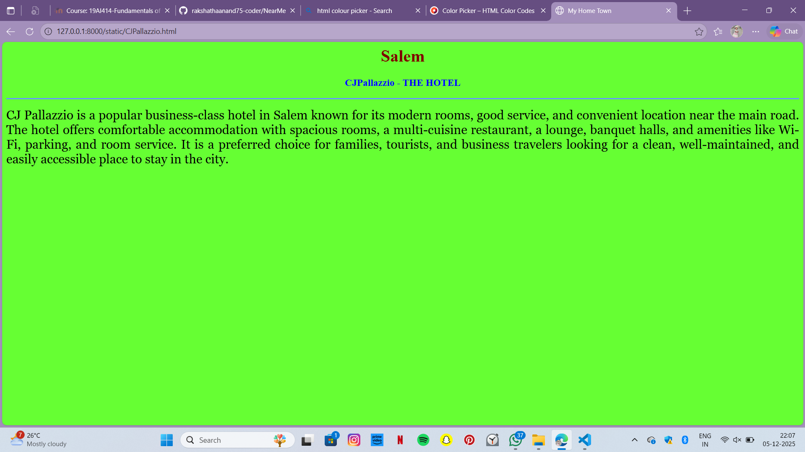

# Ex04 Places Around Me
## Date: 05.12.2025
## Referance number: 25005345

## AIM
To develop a website to display details about the places around my house.

## DESIGN STEPS

### STEP 1
Create a Django admin interface.

### STEP 2
Download your city map from Google.

### STEP 3
Using ```<map>``` tag name the map.

### STEP 4
Create clickable regions in the image using ```<area>``` tag.

### STEP 5
Write HTML programs for all the regions identified.

### STEP 6
Execute the programs and publish them.

## CODE
~~~

map.html

<html>
<head>
<title>My City</title>
</head>
<body>
<h1 align="center">
<font color="BA4594"><b>Salem</b></font>
</h1>
<h3 align="center">
    <font color="BA4594"><b>Rakshatha S A (25005345)</b></font>
</h3>
<center>

<map name="MyCity">
<area target="" alt="home" title="home" href="home.html" coords="1677,468,1811,524" shape="rect">
<area target="" alt="gandhinagar" title="gandhinagar" href="gandhinagar.html" coords="1297,93,1461,142" shape="rect">
<area target="" alt="panangadu" title="panangadu" href="panangadu.html" coords="137,529,279,576" shape="rect">
<area target="" alt="CJPallazzio" title="CJPallazzio" href="CJPallazzio.html" coords="712,136,874,190" shape="rect">
<area target="" alt="addidas" title="addidas" href="addidas.html" coords="981,154,56" shape="circle">
<area shape="rect" coord="100,100,900,900" href="610" title="My Home Town">
</map>
</centre>
</body>
</html>

home.html

<html>
<head>
<title>My Home Town</title>
</head>
<body bgcolor="#6666ff">
<h1 align="center">
<font color="#800000"><b>Salem</b></font>
</h1>
<h3 align="center">
<font color="blue"><b>Home - The comfort place</b></font>
</h3>
<hr size="3" color="#ff66cc">
<p align="justify">
<font face="Georgia" size="5">
My home is a warm and happy place because of my loving parents and my playful pet dogs. 
My parents always support me, guide me, and make sure our home is filled with care and comfort. 
Our dogs add even more joy with their cute habits, loyalty, and endless energy. Whether it’s 
relaxing together, talking, or playing with the dogs, every moment at home feels peaceful and special. 
My home is where I feel safe, loved, and truly myself.
</font>
</p>
</body>
</html>

gandhinagar.html

<html>
<head>
<title>My Home Town</title>
</head>
<body bgcolor="#00cc99">
<h1 align="center">
<font color="#800000"><b>Salem</b></font>
</h1>
<h3 align="center">
<font color="blue"><b>gandhinagar - Zoo</b></font>
</h3>
<hr size="3" color="#66ffff">
<p align="justify">
<font face="Georgia" size="5">
    The Kuruvampatti Zoo in Salem is a small zoo near the Shevaroy Hills. It has animals like deer,
    peacocks, crocodiles, and many birds. Kuruvampatti Zoo is an ideal spot for family outings, school trips,
    and nature lovers. The zoo promotes wildlife protection and creates awareness about preserving the environment 
    while offering a relaxing experience away from the busy city.
</font>
</p>
</body>
</html>

panangadu.html

<html>
<head>
<title>My Home Town</title>
</head>
<body bgcolor="#CFB25B">
<h1 align="center">
<font color="#800000"><b>Salem</b></font>
</h1>
<h3 align="center">
<font color="blue"><b>Panangadu - If peace was a place</b></font>
</h3>
<hr size="3" color="#ff9999">
<p align="justify">
<font face="Georgia" size="5">
   Panangadu is a small village located in the Salem district of Tamil Nadu. It is known for its peaceful 
   rural environment, green fields, and traditional lifestyle. The area is surrounded by natural beauty and farms,
   making it a calm place away from the busy city. People in Panangadu mainly depend on agriculture and local trades
   for their livelihood. It is a quiet and friendly village that reflects the culture and simplicity of rural Tamil Nadu.
</font>
</p>
</body>
</html>

CJPallazzio.html

<html>
<head>
<title>My Home Town</title>
</head>
<body bgcolor="#66ff33">
<h1 align="center">
<font color="#800000"><b>Salem</b></font>
</h1>
<h3 align="center">
<font color="blue"><b>CJPallazzio - THE HOTEL</b></font>
</h3>
<hr size="3" color="#6699ff">
<p align="justify">
<font face="Georgia" size="5">
   CJ Pallazzio is a popular business-class hotel in Salem known for its modern rooms, good service, and 
   convenient location near the main road. The hotel offers comfortable accommodation with spacious rooms, 
   a multi-cuisine restaurant, a lounge, banquet halls, and amenities like Wi-Fi, parking, and room service. 
   It is a preferred choice for families, tourists, and business travelers looking for a clean, well-maintained, 
   and easily accessible place to stay in the city.
</font>
</p>
</body>
</html>

addidas.html

<html>
<head>
<title>My Home Town</title>
</head>
<body bgcolor="#cc66ff">
<h1 align="center">
<font color="#800000"><b>Salem</b></font>
</h1>
<h3 align="center">
<font color="blue"><b>addidas franchise - youngsters craze</b></font>
</h3>
<hr size="3" color="#ff9933">
<p align="justify">
<font face="Georgia" size="5">
   Adidas has a strong presence in Salem through its exclusive brand outlets and franchise stores, 
   mainly located in popular commercial areas like Fairlands and Sharada College Road. These stores 
   offer a wide range of Adidas products, including sports shoes, casual footwear, athletic clothing, 
   and accessories. They are known for providing genuine, good-quality merchandise and a neat shopping experience.
   Many people in Salem visit these outlets for trendy sneakers, sportswear, and reliable customer service, 
   making Adidas one of the preferred sports brands in the city.
</font>
</p>
</body>
</html>

~~~

## OUTPUT







## RESULT
The program for implementing image maps using HTML is executed successfully.
